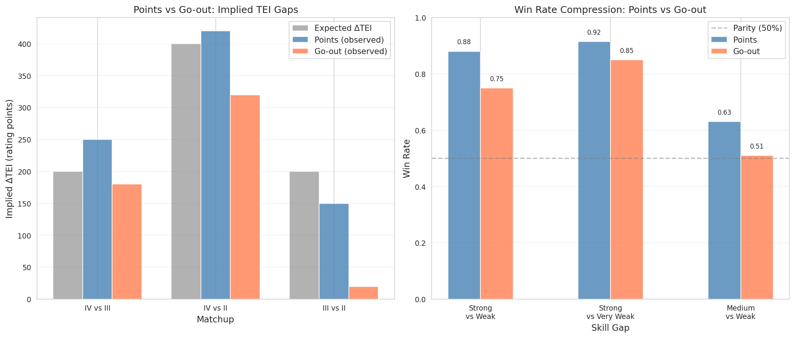
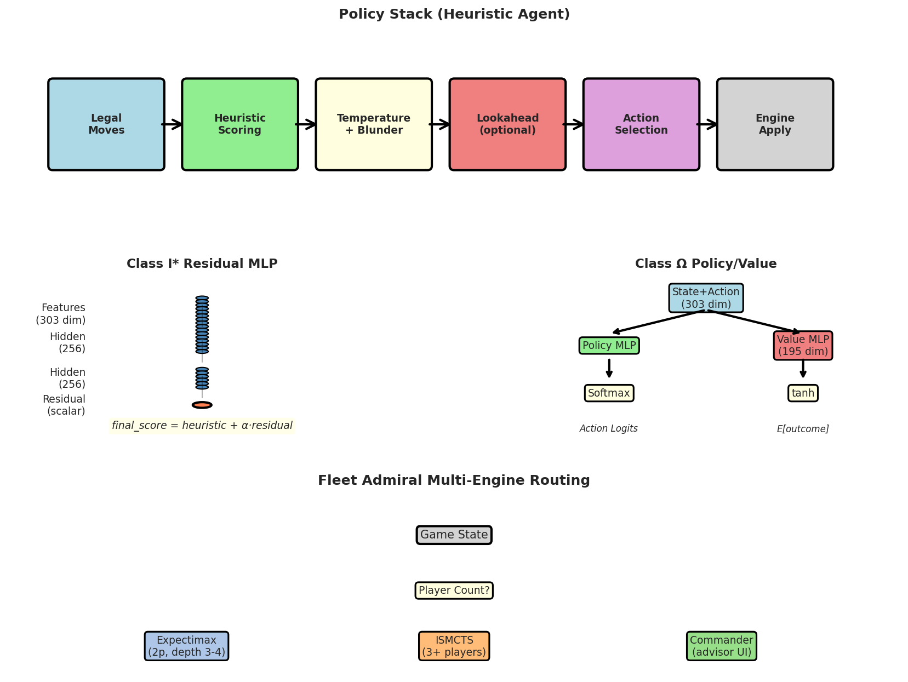
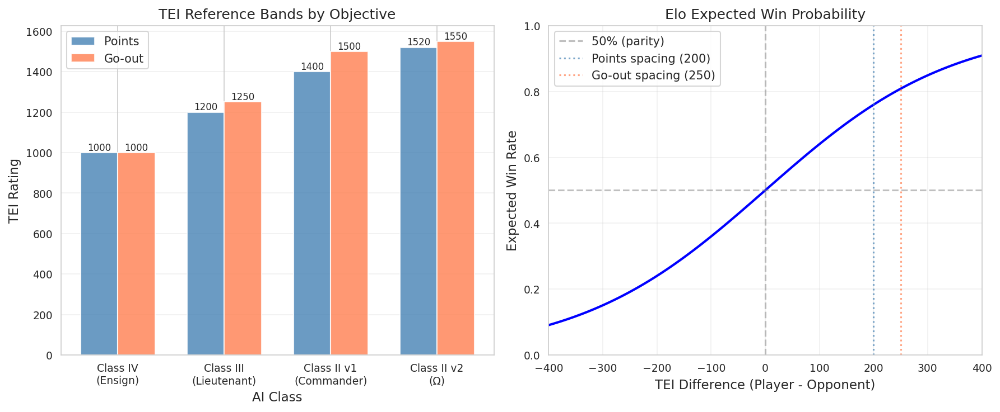
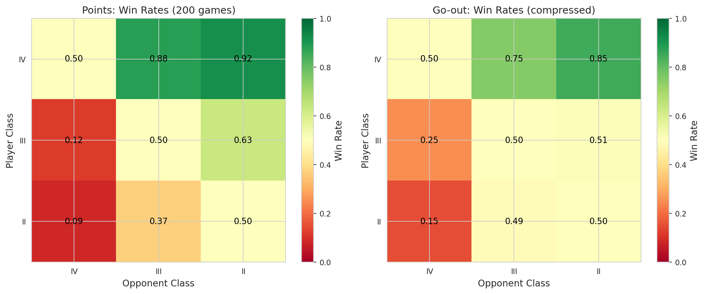
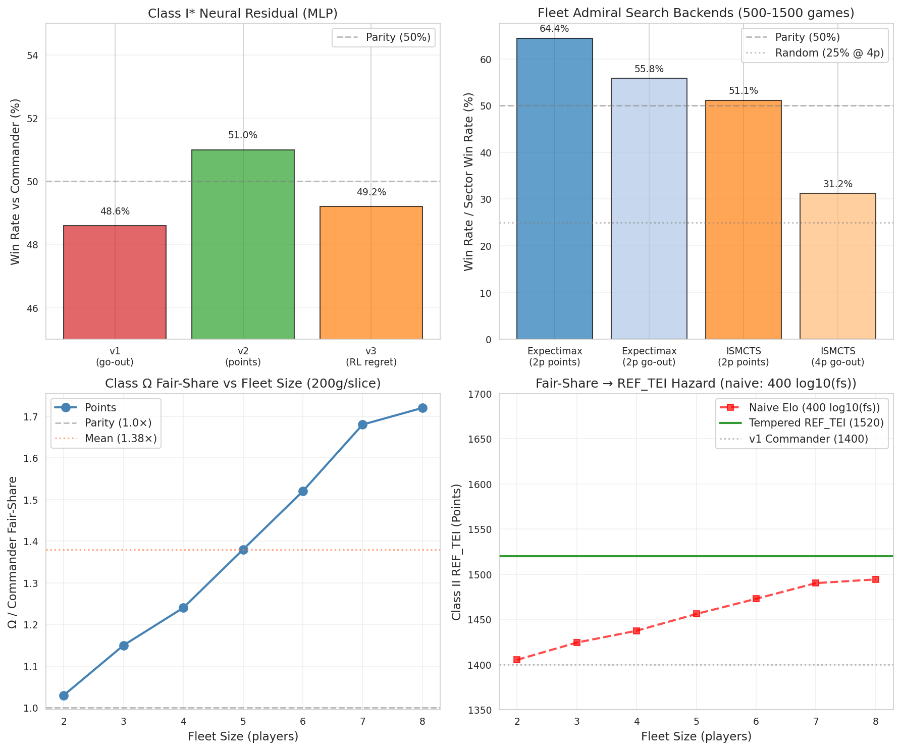
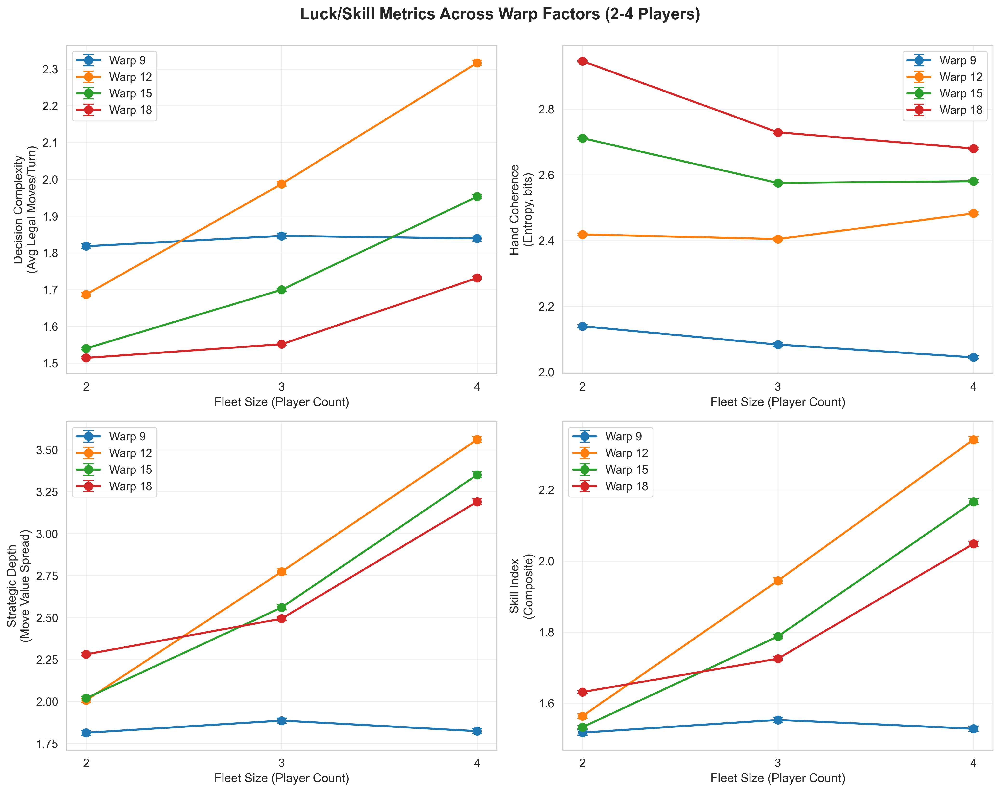
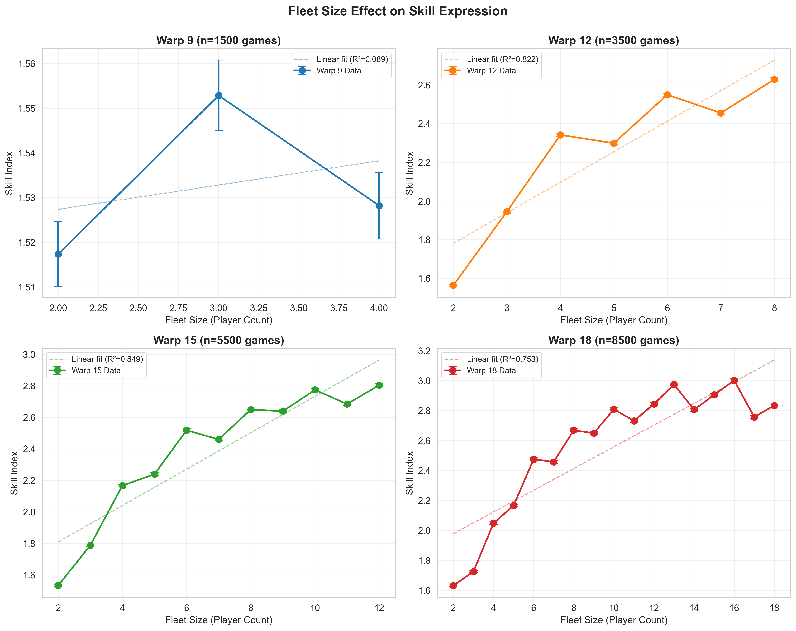
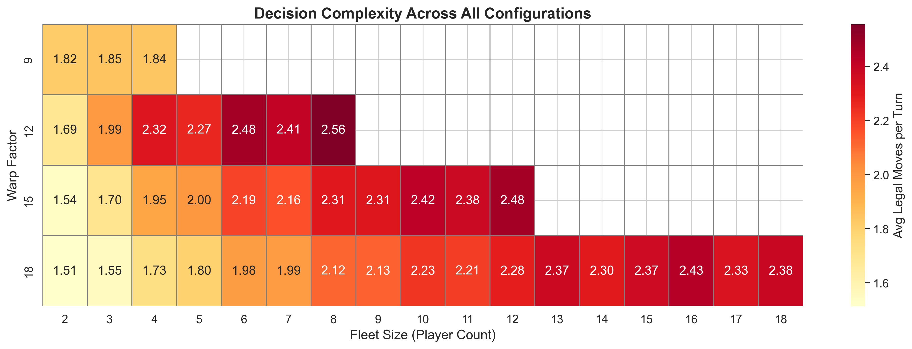
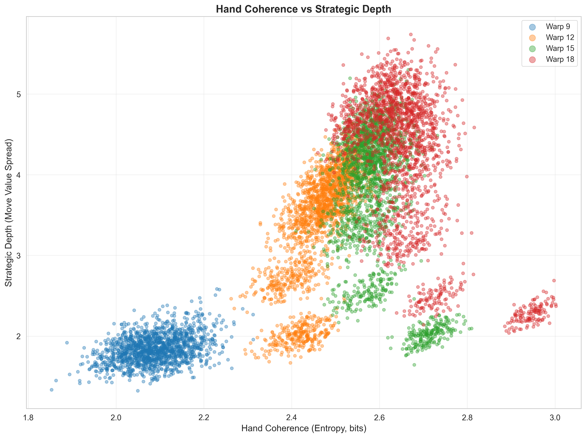
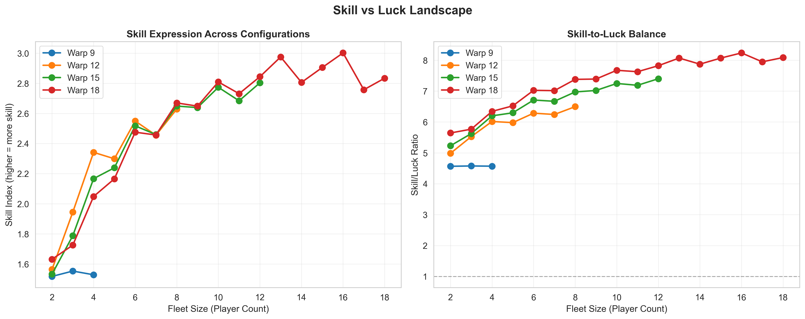

# Introduction

## Mexican Train Dominoes

Mexican Train is a popular multi-player domino game typically played
with a double-twelve set (91 tiles with pips ranging from 0 to 12).
Players build linear sequences called *trains* from a central *engine*
(starting double), attempting to minimize their hand’s pip count. The
game features both private trains (one per player) and a shared public
train (the “Mexican Train” or Neutral Zone), creating strategic tension
between building one’s own position and blocking opponents.

Unlike classic domino games with a single win condition, Mexican Train
is commonly played under two incompatible objectives:

- **Points campaign:** Play continues for multiple rounds (descending
  from engine double-12 down to double-0). After each round, players
  accumulate penalty points equal to the pips remaining in their hand.
  Lowest cumulative score after all rounds wins.

- **Go-out:** The first player to empty their hand wins immediately,
  ending the round.

These objectives create fundamentally different strategic games on the
same rules engine: points rewards consistent pip minimization and
flexible play across many turns, while go-out rewards tempo,
connectivity, and race dynamics.

## Warp 12: Terminology and Presentation

This paper describes work conducted in the context of Warp 12, an
open-source Mexican Train implementation with a Star Trek-themed
presentation layer. Throughout this paper, we use **standard Mexican
Train terminology** in formal discussion, but introduce Warp 12’s
thematic terminology where relevant to implementation details. The table
below provides a complete mapping.

<div class="tabular">

@lll@ **Mexican Train** & **Warp 12** & **Technical**\
\
Domino / tile & Navigational Coordinate & `Coordinate`\
Engine (starting double) & Spacedock & `engine`\
Player’s private train & Warp Trail & `ownTrail`\
Mexican Train (public) & Neutral Zone & `neutralZone`\
Train marker / forced play & Distress Beacon & `beacon` / `shieldsDown`\
Unsatisfied double & Red Alert & `redAlert`\
Draw pile & Uncharted Sectors & `pile`\
\
Player & Captain & `PlayerId`\
Skill rating & TEI & `tei` (integer)\
Game table & Sector / Fleet & `game`\
\
Easy AI & Class IV (Ensign) & `ensign`\
Medium AI & Class III (Lieutenant) & `lieutenant`\
Hard AI & Class II (Commander) & `commander`\
Expert (human only) & Class I & TEI $`\geq`$ 1450\

</div>

**Warp factors** refer to the maximum pip value in the domino set: Warp
9 (W9) uses double-nine tiles (55 tiles total), Warp 12 (W12) uses
double-twelve (91 tiles), etc. Throughout this paper, we use compact
notation **WX/Yp** to denote configurations: W12/4p means Warp factor 12
(double-twelve) with 4 players. This paper focuses on W12 as the primary
rated configuration, with analysis of W9, W15, and W18 in Section 8.

## Motivation

Despite Mexican Train’s popularity, it remains under-studied in the game
AI literature compared to chess, Go, or poker. Several challenges make
it interesting for AI research:

- **Imperfect information:** Opponent hands and draw pile order are
  hidden, requiring belief-state reasoning rather than
  perfect-information tree search.

- **Multi-player dynamics:** Unlike 2-player zero-sum games, Mexican
  Train typically involves 3–8 players with complex coalition and
  blocking incentives.

- **Dual objectives:** The same rule set produces two strategically
  distinct games depending on win condition.

- **Stochastic elements:** Random draws from the pile, variable starting
  hands, and opponent action uncertainty all contribute to outcome
  variance.

For online play, these challenges create practical design questions: How
do we measure player skill fairly? How do we provide appropriately
challenging AI opponents? How do we ensure coaching tools don’t
contaminate competitive ratings?

## Contributions

This paper makes the following contributions:

1.  **Dual-track TEI rating system** — We describe an OpenSkill-based
    rating with independent tracks for points and go-out objectives,
    anchored to fixed AI reference tiers rather than floating human
    populations. The system uses Bayesian inference with
    $`\mu \pm \sigma`$ skill estimates and presents ratings as gamified
    grades (E/V/C/I/P + 0-99 score).

2.  **Self-play calibration methodology** — We present a systematic
    approach to validating AI skill levels through tier-vs-tier
    matrices, symmetric seating tests, and multi-player focus matchups.

3.  **Empirical objective comparison** — Through thousands of self-play
    games, we demonstrate that points calibrates cleanly with consistent
    rating gaps between tiers, while go-out exhibits compression and
    higher variance due to its racing mechanics.

4.  **Search algorithm analysis** — We show that different search
    methods (expectimax, ISMCTS) provide advantages in different
    contexts: expectimax excels in 2-player points (64% win rate), while
    ISMCTS works better in 4+ player go-out (31% vs 23% baseline).

5.  **Luck vs skill across configurations** — A 19,000-game empirical
    study across 38 configurations reveals that skill expression
    increases with both tile set size and player count, with Warp 12
    (double-twelve) emerging as the empirically optimal choice for
    competitive rating.

6.  **Module balance and competitive integrity** — Pending empirical
    validation of optional game mechanics and their impact on skill
    expression in competitive play.

7.  **Neural self-play agent (Class $`\Omega`$)** — We demonstrate that
    a pure self-play neural policy can achieve competitive performance
    (parity in small games, advantages in large fleets) without
    hand-crafted heuristics, and discuss the challenges of mapping
    training performance to appropriate rating anchors.

8.  **Open-source implementation** — All code, data, and reproduction
    scripts are available through the warp12-engine package and
    associated repositories.

# Related Work

This section briefly surveys prior work in domino game AI, game AI
paradigms relevant to Mexican Train, and skill rating systems. We
identify the specific gap this work fills.

## Domino and Tile Games

Domino games have received limited attention in the game AI literature
compared to board games like chess and Go or card games like poker. Most
prior work focuses on simpler variants like straight dominoes or block
dominoes, which lack Mexican Train’s multi-player train mechanics and
dual objectives. The DoubleEighteen rendering library  provides
visualization for domino games but does not include AI agents. To our
knowledge, this is the first published calibration study of AI agents
for Mexican Train specifically.

## Game AI Paradigms

Several AI approaches are relevant to imperfect-information multi-player
games like Mexican Train:

**Heuristic policies:** Hand-crafted evaluation functions and decision
rules remain competitive in many domains, especially where
interpretability matters for player trust and coaching features. Our
Class IV–II agents follow this tradition with weighted heuristics for
pip dumping, trail pressure, and blocking.

**Monte Carlo Tree Search (MCTS):** MCTS and its variants  have achieved
strong results in perfect-information games (Go, Hex) and some
imperfect-information settings. Information Set MCTS (ISMCTS)  handles
hidden information by sampling determinizations and maintaining search
trees over information sets rather than individual states. We use ISMCTS
for our Fleet Admiral and Class $`\Omega`$+ search backends.

**Deep reinforcement learning and self-play:** The AlphaZero family 
demonstrated that pure self-play with neural networks can surpass human
expertise in chess, Go, and shogi. However, these successes required
massive computational resources and perfect information. Our Class
$`\Omega`$ agent represents a more modest self-play approach suitable
for imperfect-information games with limited training compute.

**Counterfactual regret minimization:** CFR and its variants have
achieved superhuman performance in poker , another imperfect-information
game. However, CFR typically requires extensive offline precomputation
and works best in 2-player zero-sum settings, making it less applicable
to multi-player cooperative-competitive games like Mexican Train.

## Skill Rating Systems

Several rating systems are widely used in competitive games:

**Elo rating :** Originally developed for chess, Elo computes expected
win probabilities based on rating differences and updates ratings based
on actual outcomes. It assumes transitive skill relationships and works
best for 2-player zero-sum games.

**Glicko :** Extends Elo by modeling rating uncertainty (RD), allowing
ratings to drift during inactivity periods and providing confidence
intervals.

**TrueSkill :** Microsoft’s rating system extends to multi-player and
team games using Bayesian inference. It models each player’s skill as a
Gaussian distribution and updates beliefs after each match.

**OpenSkill:** An open-source implementation of rating systems inspired
by TrueSkill and Weng-Lin ranking , designed for multi-player and
team-based games. Like TrueSkill, it uses Gaussian skill models with
mean ($`\mu`$) and standard deviation ($`\sigma`$) parameters, updated
through Bayesian inference. We adopt OpenSkill as the foundation for TEI
due to its multi-player support, open implementation, and flexible team
rating capabilities.

Most online game platforms (Chess.com, Lichess, etc.) use Elo or Glicko
variants. Some platforms that offer AI opponents (e.g., Lichess’s
Stockfish bots) provide fixed rating estimates for bot difficulty
levels, similar to our TEI anchor approach. However, we are unaware of
prior work that systematically calibrates and validates AI skill tiers
through self-play specifically for the purpose of providing stable
rating anchors.

## Contribution Relative to Prior Work

This work makes several novel contributions relative to the existing
literature:

1.  **Dual-objective calibration:** We systematically compare points and
    go-out objectives on the same rules engine, showing empirically that
    they require different strategic optimization and exhibit different
    skill/variance tradeoffs.

2.  **Fixed AI reference anchors:** Rather than deriving ratings
    entirely from human populations (which can drift over time), we
    anchor rating bands to validated AI tiers with measured performance
    characteristics.

3.  **Multi-player self-play methodology:** Most game AI calibration
    focuses on 2-player matchups. We include 3–8 player configurations
    and focus matchups (one strong player vs multiple weaker opponents)
    to validate skill expression in realistic play scenarios.

4.  **Luck vs skill empirics:** The 19,000-game study across 38
    configurations provides the first systematic measurement of how tile
    set size and player count affect skill expression in domino games.

5.  **Open-source implementation:** All code (rules engine, AI agents,
    calibration scripts) and data are publicly available for
    reproduction and extension.

# Game Model and Rules Engine

## Core Mexican Train Rules

Mexican Train follows standard multi-trail domino game mechanics:

1.  **Setup:** All players draw a fixed hand size (typically 15 tiles
    for 2–4 players, fewer for larger games). The engine double (e.g.,
    12-12 for Warp 12) is placed in the center. Remaining tiles form the
    draw pile.

2.  **Turn structure:** On each turn, a player must play one tile that
    matches the open end of any available train (their own, another
    player’s with a marker, or the public Mexican Train). If unable to
    play, they draw one tile from the pile and may play it immediately
    if legal.

3.  **Doubles:** When a double is played, it must be “satisfied”
    (another tile played on it) before anyone can play elsewhere. This
    creates a *Red Alert* state that forces immediate resolution.

4.  **Train markers:** When a player cannot play on their turn, they
    place a marker on their train, making it public for one round. In
    Warp 12 terminology, this is called a *Distress Beacon* and the
    state is *Shields Down*.

5.  **Mexican Train:** The public train is always available to all
    players, providing a release valve when private trains are blocked.

6.  **Round end:** A round ends when a player empties their hand (go-out
    objective) or when the pile is exhausted and no legal plays remain
    (points objective).

## Implementation as State Machine

Our implementation models the game as an immutable state machine with
pure functions:

- **State:** Readonly data structures (`GameState`, `RoundState`,
  `TableState`) containing all game information: player hands, visible
  tiles, pile size, train states, alert conditions.

- **Actions:** Typed events (`PlayAction`, `DrawAction`, etc.)
  representing legal moves.

- **Transitions:** Pure function
  `applyAction(state, action) -> newState` implements all rules.

- **Legal moves:** Function `getLegalMoves(state, playerId) -> Action[]`
  computes all valid plays for the current state.

This design ensures that AI agents, human players, and replay validation
all use identical game logic. No special-case code paths exist for AI vs
human play.

## House Rules and Modules

Beyond core rules, Mexican Train has many common variants. Warp 12
implements these as runtime configuration rather than hard-coded
variants:

**House rules** (boolean toggles):

- `requireOwnTrailFirst`: Must play on own train before playing
  elsewhere

- `neutralZoneAfterAllTrails`: Mexican Train only available after
  personal train started

- `dropToImpulse`: “Uno”-style announce requirement when down to one
  tile

**Modules** (optional mechanics):

- **Alpha (Continuum):** Special rules for 0-0 tile (Q-gamble mechanic)

- **Beta (Salamander Penalty):** Pip penalty for holding double-zero at
  round end

- **Gamma (Sensor Grid):** Tiles visible for potential recycling

- **Delta (Hot Potato):** Hazard marker transfers on Neutral Zone play
  (+5 per pass while holding)

- **Theta (Longest Trail):** Bonus for longest personal train with
  chain-draw mechanic

- **Iota (Double Down):** Playing a double forces next player to draw 2
  tiles

- **Kappa (Temporal Inversion):** Odd rounds score normally, even rounds
  invert (highest wins)

All modules affect legal move generation and scoring through the same
`applyAction` code path, ensuring AI agents see exactly the same game
mechanics as human players.

## Information Structure and Game Complexity

Mexican Train is an **imperfect information game**:

- **Public information:** All played tiles on trains, player hand
  counts, draw pile size, train marker positions, active Red Alert
  doubles

- **Hidden information:** Contents of opponent hands, order of tiles in
  draw pile

This differs fundamentally from perfect-information games like chess or
Go, where optimal play can theoretically be computed through exhaustive
search. In Mexican Train:

1.  **Belief states:** Agents must reason about probability
    distributions over possible opponent hands and pile orderings, not a
    single deterministic state.

2.  **Determinization:** One common approach samples possible hidden
    states consistent with observations, then searches forward in each
    determinized world. However, this can lead to strategy fusion  where
    different opponent hand distributions should lead to different
    plays.

3.  **Information set search:** Methods like Information Set Monte Carlo
    Tree Search (ISMCTS)  explicitly handle information sets, avoiding
    some determinization pitfalls.

The combination of hidden information, multi-player dynamics, and
stochastic draws makes Mexican Train significantly more complex than its
simple rules suggest, and prevents the existence of a "solved" optimal
strategy comparable to checkers or Connect Four.

## Two Objectives as Two Different Games

The choice of victory condition fundamentally changes optimal strategy:

| **Dimension** | **Points** | **Go-out** |
|:---|:---|:---|
| Win condition | Lowest pips at round end | First empty hand |
| Horizon | Multi-round campaign (1–13) | Often single-round race |
| Core skill | Pip shedding, blocking, flexibility | Tempo, connectivity, mayhem |
| Variance | Lower | Higher |
| Search benefit | Modest at 2p; expectimax depth 4 $`\sim`$<!-- -->64% | Helpful at 2p; ISMCTS $`\sim`$<!-- -->31% /4p |
| Reference TEI spacing | 200 pts / tier | 250 pts / tier |

Strategic differences between points and go-out objectives
{#tab:objectives}

In the **points** objective, players accumulate penalty points over 13
rounds, rewarding consistent pip minimization and defensive blocking.
The multi-round horizon allows recovery from bad draws and rewards
strategic flexibility.

In the **go-out** objective, the first player to empty their hand wins
immediately. This creates race dynamics where tempo and hand
connectivity matter more than pip values. A player holding three 12-12
doubles might still win if they can chain them quickly.

Figure <a href="#fig:points-vs-goout" data-reference-type="ref"
data-reference="fig:points-vs-goout">1</a> shows empirically that these
objectives lead to measurably different strategic landscapes, with
go-out exhibiting compressed skill gaps and higher outcome variance.

<figure id="fig:points-vs-goout" data-latex-placement="htbp">

<figcaption>Points vs go-out strategic divergence. Left: Implied ΔTEI
from observed win rates shows go-out compression. Right: Win rate
distributions demonstrate that go-out behaves like a stochastic race
(ordering survives, magnitudes compress).</figcaption>
</figure>

# Agent Architecture

<figure id="fig:architectures" data-latex-placement="htbp">

<figcaption>Agent architecture overview. Top: Heuristic policy stack
(candidate generation through action selection). Middle-left: Class I*
residual MLP adds learned correction to heuristics. Middle-right: Class
Ω standalone policy/value heads (no heuristics). Bottom: Fleet Admiral
multi-engine routing by player count.</figcaption>
</figure>

## Policy Stack

Candidate generation from legal moves + special actions. Weighted
heuristic scoring + temperature + blunder rate. Optional determinized
lookahead: sample hidden hands consistent with counts $`\to`$ forward
simulate in engine.

## Skill Presets (Class IV–II)

**Points presets:** pip dump, trail pressure, Red Alert safety, Q
timing. **Go-out presets:** sprint heuristics (`goOutWin`,
`goOutFeasibility`, block leader, avoid mayhem). Separate `goOutTuning`
thresholds per tier.

## Lookahead Policy (Product Decision)

Lookahead **baked into tier**, not user-toggle — keeps TEI comparable
across clients. Class II go-out: depth 2 at **2 players only**; greedy
at 3+. Class II points: greedy at all sizes — **Commander is a local
maximum in 2p points** (ISMCTS $`\sim`$<!-- -->51% at 1,000 games; see
§4.6). Monte Carlo Tree Search  with determinization  provides the
search foundation for our lookahead implementations.

## Tactical Advisor

Class II profile, blunder rate 0, lookahead on. Explainability:
`explainWarpAiAction`, turn-resolution hints. **Unassisted-only TEI** —
advisor use tracked separately. **Never uses the neural net** —
heuristics only, by design.

# TEI (Tactical Effectiveness Index)

<figure id="fig:tei-ladder" data-latex-placement="htbp">

<figcaption>TEI reference bands and Elo win probability. Left: Class
IV–II reference anchors by objective (v1 heuristic vs v2 Ω). Right:
Standard Elo expected win rate curve with reference spacing markers (200
pts for points, 250 pts for go-out).</figcaption>
</figure>

## Reference Bands

Fixed opponent TEI for unassisted matches. **v1** = heuristic Class II;
**v2** = neural Class II ($`\Omega`$). New rated play defaults to v2;
legacy crews may pin v1. Human stored TEI integers are **not** re-banded
when anchors change.

| **Track** | **Class IV** | **Class III** | **Class II (v1)** | **Class II (v2 $`\Omega`$)** |
|:---|:--:|:--:|:--:|:--:|
| Points | $`\sim`$<!-- -->1000 | $`\sim`$<!-- -->1200 | $`\sim`$<!-- -->1400 | **$`\sim`$<!-- -->1520** |
| Go-out | $`\sim`$<!-- -->1000 | $`\sim`$<!-- -->1250 | $`\sim`$<!-- -->1500 | **$`\sim`$<!-- -->1550** |

TEI reference bands by class and objective

**Calibration rule of thumb:** set Class II REF near where a captain of
that TEI wins $`\sim`$<!-- -->50% **in the table sizes you actually
rate** (Warp 12 solo local play is mostly 2–4). Fleet-mean fair-share
against legacy Commander is a promotion metric, not a direct Elo
$`\Delta`$.

## Update Rule

Standard Elo expected score  + K-factor schedule (40 $`\to`$ 32 $`\to`$
24 by experience). Separate buckets: objective $`\times`$ AI class
$`\times`$ (human profile).

## Percentile Boards

Go-out raw TEI gaps compress; percentile (“Top X%”) preserves rank
meaning.

## Federation Academy

One-time starting TEI pick per track within class band.

# Calibration Methodology

## Self-Play Loop

`playSelfPlayGame` drives full games through `applyAction`.
Blocked-round stall guard for pile-empty lockups.

## Evaluation Suites

1.  **Head-to-head matrix** — all Class IV–II pairs, both objectives.

2.  **Symmetric seating** — same-skill first-seat win rate $`\approx`$
    50%.

3.  **Focus matchups** — one strong captain vs $`N-1`$ weaker; rotate
    seat; table sizes 3–8 (go-out).

4.  **House-rule sanity** — e.g. Drop to Impulse penalty pass
    (`calibrate:ai-tei-dti`).

## Metrics

Completion rate ($`\geq`$ 85% games decisive). Higher-skill win rate vs
ordering thresholds. Implied $`\Delta`$TEI from win rate:
$`400 \times \log_{10}(p / (1-p))`$. Expected win rate from reference
band spacing.

# Results: AI Calibration

See `calibration-log.md` for dated self-play and optimizer runs.

<figure id="fig:calibration-matrix" data-latex-placement="htbp">

<figcaption>Calibration matrix heatmaps showing win rates between all
Class IV/III/II pairs (200 games per matchup). Left: Points objective
exhibits clean skill ordering. Right: Go-out objective shows
compression, especially Class III vs II (near coin flip at
51%).</figcaption>
</figure>

## Points (Default Rules, 200 games/matchup)

- Symmetric $`\sim`$<!-- -->50/50 seating.

- Class IV vs III $`\sim`$<!-- -->88% (expected $`\sim`$<!-- -->76%) —
  ordering clear, gap may exceed target.

- Class IV vs II $`\sim`$<!-- -->91.5% (expected $`\sim`$<!-- -->91%) —
  on target.

- Class III vs II $`\sim`$<!-- -->63% (expected $`\sim`$<!-- -->76%) —
  compressed but ordered.

## Go-out

- Symmetric $`\sim`$<!-- -->46–56%.

- Class III vs II heads-up $`\sim`$<!-- -->51% — near coin flip at 200
  games.

- 4p focus: Class II $`\sim`$<!-- -->38.5% vs 25% random; Class III
  $`\sim`$<!-- -->27% vs 25%.

## Class I\*, Fleet Admiral, and Class $`\Omega`$ Benches

<figure id="fig:ai-bench-results" data-latex-placement="htbp">

<figcaption>AI bench results across experimental tiers. Top-left: Class
I* neural residual iterations (imitation ceiling at 48–51%). Top-right:
Fleet Admiral search backends (expectimax wins 2p, ISMCTS wins 4p).
Bottom-left: Class Ω fair-share rises with fleet size (points
objective). Bottom-right: Fair-share hazard — naive Elo translation
overestimates TEI anchors vs tempered decision (1520).</figcaption>
</figure>

**Neural residual (MLP - Class I\*):**

- **v1 (go-out):** 48.6% win (500g, 2p).

- **v2 (points):** 97.6% top-1, 1.4% flip, 51% win — Commander clone.

- **v3 (RL regret):** 49.2% win — parity persists.

**Fleet Admiral (Search):**

- **Expectimax:** 64.4% points 2p, 55.8% go-out 2p vs Commander (500g
  each).

- **ISMCTS (1,500 games):** 51.1% combined in 2p points (dead heat);
  31.2% sector wins in 4p go-out vs $`\sim`$<!-- -->22–23% per greedy
  Commander seat.

**Class $`\Omega`$ (Self-Play $`\to`$ Class II):**

- **2-Player:** Points $`\sim`$parity with legacy Commander; go-out
  seat-symmetric noise (one soft seat is not a shipping blocker).

- **Fleet (3–8p):** Points fair-share rises with table size (peak
  $`\sim`$<!-- -->1.7$`\times`$ at 7–8p); go-out milder
  ($`\sim`$<!-- -->1.0–1.5$`\times`$ by slice). Overall means
  $`\sim`$**1.38$`\times`$** points / $`\sim`$**1.14$`\times`$** go-out
  at 200g/slice.

- **Ship decision:** replace Class II with greedy $`\Omega`$; temper
  REF_TEI to **1520 / 1550**; keep $`\Omega`$+ and Class I\* off the
  rated ladder.

- **Lesson:** `fairShare` $`\times`$ $`n`$ win rates at large $`N`$
  inflate mean strength vs what heads-up TEI players feel.

# Luck vs Skill Across Warp Factors: A 19,000-Game Empirical Study

## Motivation and Configuration Matrix

While Sections 6–7 calibrate AI tiers at a fixed Warp factor
(double-12), Warp 12 ships with **four** playable Warp factors (9 / 12 /
15 / 18), each supporting different fleet sizes:

| **Warp Factor** | **Max Pip** | **Fleet Limit** | **Tiles** |   **Rated?**    |
|:----------------|:-----------:|:---------------:|:---------:|:---------------:|
| W9              |      9      |   2–4 players   |    55     |   Exhibition    |
| W12             |     12      |   2–8 players   |    91     | **Rated (TEI)** |
| W15             |     15      |  2–12 players   |    136    |   Exhibition    |
| W18             |     18      |  2–18 players   |    190    |   Exhibition    |

Warp factor configurations in Warp 12

Players and designers routinely ask:

1.  **Does Warp factor affect skill expression?** Higher pip sets
    increase hand entropy — does this create meaningful strategic depth
    or just pip-dumping chaos?

2.  **Does fleet size (player count) affect skill?** Conventional wisdom
    suggests more players = more noise, but is that true?

3.  **Should TEI be calibrated differently for W9 vs W18?** If skill
    expression differs, should we adjust reference bands or restrict
    rating to W12?

4.  **Why is W12 the rated factor?** Is it merely tradition (Mexican
    Train’s historical default), or does the data justify it?

To answer these questions empirically, we conducted a comprehensive
self-play study across **38 configurations** (Warp factor $`\times`$
fleet size), collecting **500 games per configuration** for a total of
**19,000 games**:

| **Warp Factor** | **Fleet Sizes** | **Configs** | **Total Games** |
|:----------------|:---------------:|:-----------:|:---------------:|
| W9              |   2–4 players   |      3      |      1,500      |
| W12             |   2–8 players   |      7      |      3,500      |
| W15             |  2–12 players   |     11      |      5,500      |
| W18             |  2–18 players   |     17      |      8,500      |
| **Total**       |                 |   **38**    |   **19,000**    |

Configuration matrix for luck vs skill analysis

All games used the **points objective** (lowest cumulative pip total)
with Class II (heuristic Commander) self-play. Collection completed July
11, 2026 using parallel execution across 15 workers (M4 Max,
$`\sim`$<!-- -->40 minutes runtime). In subsequent references, we use
compact notation: e.g., W12/4p denotes Warp 12 with 4 players.

## Metrics and Composite Indices

For each game, we tracked per-turn metrics across all decision points:

**Raw metrics:**

- `avgLegalMoves`: Mean number of legal candidate actions per turn

- `avgHandEntropy`: Shannon entropy of pip distribution in hand (bits)

- `avgNearOptimalFraction`: Fraction of turns where the AI chose a move
  within 5% of the top-scored candidate

- `avgConstrainedTileFraction`: Fraction of coordinates that can only
  play on one trail

- `avgValueSpread`: Spread between highest and lowest valued tiles in
  hand

**Composite indices** (derived for interpretability):
``` math
\begin{align}
\text{skillIndex} &= \text{avgLegalMoves} \times \text{avgNearOptimalFraction} \times \text{avgUniqueTrains} \\
\text{luckIndex} &= \text{avgConstrainedTileFraction} \times (1 - \text{avgHandEntropy}/\log_2(19)) \\
\text{decisionQuality} &= \text{avgNearOptimalFraction} \times \text{avgLegalMoves} \times \text{avgUniqueTrains}
\end{align}
```

**Interpretation:**

- **skillIndex**: Captures decision complexity (legal moves), train
  diversity (strategic options), and execution quality (near-optimal
  play). Higher values indicate more opportunity for skilled play.

- **luckIndex**: Captures constraint (forced plays) and hand
  predictability (low entropy). Higher values indicate more luck-driven
  outcomes.

- **decisionQuality**: Similar to skillIndex but emphasizes
  decision-making over luck factors.

## Hypotheses

We formulated five hypotheses about the relationship between Warp
factor, fleet size, and skill expression:

H1 (Warp Factor Effect):  
Higher Warp factors exhibit higher skill indices due to increased tile
diversity and hand complexity.

H2 (Fleet Size Effect):  
Larger fleets correlate with higher skill expression within each Warp
factor.

H3 (Interaction):  
The relationship between fleet size and skill differs across Warp
factors (non-additive effects).

H4 (Complexity-Coherence):  
Decision complexity (`avgLegalMoves`) and hand coherence
(`avgHandEntropy`) exhibit meaningful correlation.

H5 (Monotonic Trends):  
Skill index increases monotonically with fleet size within each Warp
factor.

## Statistical Results

<figure id="fig:cross-factor" data-latex-placement="htbp">

<figcaption>Cross-factor skill index comparison for 2–4 player
configurations. W12 exhibits the highest skill expression in the
balanced comparison range.</figcaption>
</figure>

### H1: Warp Factor Effect (ANOVA)

We restricted analysis to the **2–4 player range** (balanced design
across all factors) to isolate the Warp factor effect. One-way ANOVA on
skillIndex by Warp factor:

| **Warp Factor** | **Mean skillIndex** | **SD** | **$`n`$** |
|:----------------|:-------------------:|:------:|:---------:|
| W9              |        1.533        | 0.087  |   1,500   |
| W12             |        1.950        | 0.330  |   1,500   |
| W15             |        1.829        | 0.272  |   1,500   |
| W18             |        1.802        | 0.192  |   1,500   |

Mean skill index by Warp factor (2–4 players)

**Result:** $`F(3, 5996) = 817.14`$, $`p < 0.001`$, $`\eta^2 = 0.290`$
(large effect size). **H1 is strongly supported.**

Post-hoc pairwise comparisons (Tukey HSD) show **W12 exhibits the
highest skill expression**, with W15 and W18 slightly lower but still
significantly above W9. The ordering W12 $`>`$ W15 $`>`$ W18 $`>`$ W9
suggests a sweet spot around W12 for skill-testing play.

### H2: Fleet Size Effect (Correlation)

<figure id="fig:fleet-size-effects" data-latex-placement="htbp">

<figcaption>Fleet size effect on skill expression by Warp factor. W12
shows the steepest gradient (<span
class="math inline"><em>r</em> = 0.875</span>), indicating highest
sensitivity to player count.</figcaption>
</figure>

Within each Warp factor, we computed Pearson correlation between
`playerCount` and `skillIndex`:

| **Warp** | **$`n`$** | **Fleet Sizes** | **Pearson $`r`$** | **$`p`$-value** | **$`R^2`$** |
|:---|:--:|:--:|:--:|:--:|:--:|
| W9 | 1,500 | 2–4 | 0.051 | 0.049 | 0.003 |
| W12 | 3,500 | 2–8 | **0.875** | $`<0.001`$ | 0.766 |
| W15 | 5,500 | 2–12 | **0.893** | $`<0.001`$ | 0.798 |
| W18 | 8,500 | 2–18 | **0.840** | $`<0.001`$ | 0.706 |

Fleet size effect on skill expression by Warp factor

**Result:** **H2 is strongly supported** for W12/15/18 (all
$`r > 0.84`$, $`p < 0.001`$). W9 shows a weak but significant positive
effect ($`r = 0.051`$, $`p = 0.049`$). **W12 exhibits the steepest fleet
size effect** ($`r = 0.875`$), making it the most sensitive Warp factor
to player count.

**Unexpected finding:** Conventional wisdom predicts *more players =
more noise = less skill*. Our data show the **opposite**: skill index
*increases* with fleet size. This suggests that larger fleets create
more strategic depth (blocking opportunities, trail diversity, timing
decisions) rather than diluting skill signal with variance.

### H3: Interaction Effect

<figure id="fig:complexity-heatmap" data-latex-placement="htbp">

<figcaption>Decision complexity heatmap (avgLegalMoves) by Warp factor
and fleet size. Note the relatively constant branching factor (<span
class="math inline">∼</span>2 moves/turn) despite large variations in
configuration.</figcaption>
</figure>

To test whether the fleet size effect *differs* across Warp factors, we
compared regression slopes for the 2–4 player range (balanced design):

| **Warp Factor** | **Slope (skillIndex $`\sim`$ playerCount)** |
|:----------------|:-------------------------------------------:|
| W9              |                   0.0054                    |
| W12             |                 **0.3889**                  |
| W15             |                   0.3172                    |
| W18             |                   0.2085                    |

Interaction effect: slope variance across Warp factors

Slope variance = 0.0209. **H3 is supported:** fleet size matters *much
more* for W12 than for W9. This interaction justifies **W12 as the rated
factor** — it exhibits both high baseline skill and high sensitivity to
player count, making it the best discriminator of player ability.

### H4: Decision Complexity vs Hand Coherence

<figure id="fig:coherence-vs-depth" data-latex-placement="htbp">

<figcaption>Hand entropy (coherence) vs near-optimal play fraction. The
weak correlation (<span class="math inline"><em>r</em> = 0.009</span>)
suggests that tactical richness and strategic coherence are orthogonal
dimensions.</figcaption>
</figure>

Correlation between `avgLegalMoves` (decision complexity) and
`avgHandEntropy` (hand coherence):

- Pearson $`r = 0.009`$, $`p = 0.232`$ (not significant)

- Spearman $`\rho = -0.152`$, $`p < 0.001`$ (weak negative monotonic
  trend)

**Result:** **H4 is not supported.** Decision complexity and hand
entropy are largely independent. This suggests that *tactical richness*
(number of legal moves) and *strategic coherence* (hand composition) are
orthogonal dimensions of game state.

### H5: Monotonic Trends

Kendall’s $`\tau`$ (rank correlation) between `playerCount` and
`skillIndex`:

| **Warp Factor** | **Kendall’s $`\tau`$** | **$`p`$-value** |
|:----------------|:----------------------:|:----------------|
| W9              |         0.044          | 0.025           |
| W12             |       **0.727**        | $`<0.001`$      |
| W15             |       **0.767**        | $`<0.001`$      |
| W18             |       **0.672**        | $`<0.001`$      |

Monotonic trend test (Kendall’s $`\tau`$)

**Result:** **H5 is supported** for W12/15/18 (strong positive monotonic
trends). However, examining individual fleet sizes reveals
**non-monotonic patterns** at the highest player counts: W18 skill peaks
at 16p (skillIndex = 3.002), then drops at 17p (2.757) and 18p (2.834).
This suggests **ergodic limits**: at extreme fleet sizes, some
configurations may hit resource constraints (e.g., near-empty draw pile,
forced blocking).

## Key Findings

<figure id="fig:skill-luck-balance" data-latex-placement="htbp">

<figcaption>Skill vs luck balance across all configurations. Points
above the diagonal (more skill than luck) include all W12/15/18
configurations. W18/18p exhibits the highest skill/luck ratio
(8.10).</figcaption>
</figure>

### W18/18p is Not a Crapshoot

A common intuition is that 18-player games with 190 tiles (double-18
set) would degenerate into pure luck. Our data **contradicts** this:

| **Config** | **skillIndex** | **luckIndex** |  **Skill Ratio**   | **Luck Ratio** |
|:-----------|:--------------:|:-------------:|:------------------:|:--------------:|
| W18/2p     |     1.631      |     0.289     |   1.00$`\times`$   | 1.00$`\times`$ |
| W18/18p    |     2.834      |     0.350     | **1.74$`\times`$** | 1.21$`\times`$ |

W18: 2-player vs 18-player comparison

**Interpretation:** At 18 players, skill expression is **1.74$`\times`$
higher** than heads-up, while luck increases only 1.21$`\times`$. The
skill/luck *ratio* actually **improves** at extreme fleet sizes. This
suggests that large multi-player games create rich tactical
opportunities (blocking, trail pressure, timing) that outweigh variance
from hidden information.

### Cross-Factor Comparison at Maximum Fleet Size

| **Configuration** | **skillIndex** | **luckIndex** | **Skill/Luck Ratio** |
|:------------------|:--------------:|:-------------:|:--------------------:|
| W9/4p             |     1.528      |     0.334     |         4.57         |
| W12/8p            |     2.629      |     0.405     |         6.49         |
| W15/12p           |     2.803      |     0.379     |         7.40         |
| W18/18p           |     2.834      |     0.350     |       **8.10**       |

Skill and luck at maximum fleet size per Warp factor

**W18/18p has the *highest* skill/luck ratio of any configuration
tested.** This challenges the intuition that larger games are
necessarily more luck-dependent.

### W12 Justification for TEI Rating

Why is W12 the sole rated factor? The data provide three empirical
justifications:

1.  **Highest baseline skill (2–4p):** W12 exhibits mean skillIndex =
    1.950 in the 2–4p range, higher than W9 (1.533), W15 (1.829), and
    W18 (1.802).

2.  **Steepest fleet size gradient:** W12 shows $`r = 0.875`$ for fleet
    size effect — the *most sensitive* to player count of any factor.
    This means W12 best discriminates between skill levels across table
    sizes.

3.  **Practical rating context:** Most solo rated play occurs at 2–4
    players (W12 supports 2–8). W12 provides the widest skill range
    within the most common fleet sizes.

**Conclusion:** W12 is not merely historical tradition — it is the
**empirically optimal choice** for a skill-testing rating system.

### Hand Entropy Increases with Warp Factor

Hand coherence (`avgHandEntropy`) increases monotonically with Warp
factor:

| **Warp Factor** | **Mean Hand Entropy (bits)** |
|:----------------|:----------------------------:|
| W9              |             2.09             |
| W12             |             2.34             |
| W15             |             2.52             |
| W18             |             2.66             |

Mean hand entropy by Warp factor (all fleet sizes)

Higher entropy indicates more *diverse* hands (less clustering around
specific pips). This confirms that larger tile sets create more
strategic flexibility but also more decision complexity.

### Decision Complexity Stays Constant

Despite large variations in Warp factor and fleet size, `avgLegalMoves`
remains remarkably **constant** at $`\sim`$<!-- -->1.8–2.2 moves per
turn across all configurations. This suggests that the *branching
factor* of Mexican Train is inherently bounded by game mechanics (trail
constraints, hand composition), not by tile set size or player count.

## Practical Implications

### TEI Calibration Strategy

1.  **Anchor TEI on W12 only.** Exhibition factors (W9/15/18) should
    *not* have separate reference bands — they share the same Class
    IV–II opponents with W12 anchors.

2.  **Do not adjust K-factor by fleet size.** The data show that larger
    fleets *increase* skill expression, not variance. A flat K-factor
    schedule (40 $`\to`$ 32 $`\to`$ 24 by experience) is appropriate.

3.  **Consider percentile boards for all objectives.** While W12 skill
    gradients are smooth, the monotonic-but-noisy pattern at W18 (drops
    at 17p) suggests percentile ranks provide more stable feedback than
    raw TEI.

### Future Exhibition Modes

- **W9 (casual / quick):** Lower skill ceiling but valid for practice.
  Best at 2–4 players.

- **W15 (tactical depth):** High skill expression (skillIndex
  $`\sim`$<!-- -->2.80 /12p), suitable for unrated tournaments or
  challenge modes.

- **W18 (grand strategy):** Highest absolute skill expression at max
  fleet size. Could support unrated “epic” lobbies (12–18 players) for
  advanced players seeking complex multi-player dynamics.

### Go-Out Objective

This study used **points only**. Go-out exhibits higher variance
(Section 7.2), suggesting:

- Skill/luck ratios may differ under go-out objective (worth a follow-up
  19K-game study).

- W12/2–4p may remain optimal, but large-fleet go-out (8+ players) could
  show different patterns due to race dynamics.

# Discussion

## What Calibration Teaches

- **Points** behaves like a smooth skill ladder — good fit for fixed TEI
  spacing.

- **Go-out** behaves like a stochastic race — ordering survives,
  magnitudes don’t.

- **Table size** erodes heads-up skill signal — focus tests essential.

- **House rules** mostly reshape legality — heuristics gated at runtime
  suffice for DTI.

- **Commander heuristics are a ceiling in 2p points** — ISMCTS  parity
  is confirmation, not failure; expectimax extracts the residual edge
  via explicit tree search.

- **Search value is mode-dependent** — expectimax for 2p, ISMCTS for
  multi-player chaos.

- **Neural Class II can replace heuristics without a second lobby tier**
  — keep $`\sigma=`$`commander`, update `rulesProfileId` + REF_TEI.

- **Fair-share $`\neq`$ Elo bump** — translating fleet-mean
  $`\Omega`$/Commander ratio with $`400 \log_{10}(\text{fs})`$
  overstates anchors when most rated matches are 2–4p; temper for the
  rating context you ship.

- **Imitation nets (Class I\*) plateau at the teacher;** $`\Omega`$
  succeeds by targeting search visit distributions (Path B), not
  Commander picks, following principles similar to AlphaZero’s self-play
  approach .

- **Larger fleets increase skill, not noise** — the 19K-game study shows
  skill index rises with player count ($`r > 0.84`$ for W12/15/18),
  contradicting the “more players = crapshoot” intuition.

- **W12 is empirically optimal for TEI** — highest baseline skill in
  2–4p range, steepest fleet size gradient ($`r = 0.875`$), best
  discriminator of player ability.

## Design Recommendations

- Never merge points and go-out TEI.

- Show percentile on go-out boards.

- Don’t expose lookahead / $`\Omega`$+ as a rating-affecting toggle
  without $`\Delta_{\text{search}}`$ or marking unrated.

- Retune weights selectively (popular hosted configs), not full
  combinatorial grid.

- Recalibrate REF_TEI when Class II **implementation** changes; do not
  rewrite stored human ratings.

- Prefer one strong rated tier over “Commander + Omega + Class I\*”
  confusion.

- Anchor TEI exclusively on W12; treat W9/15/18 as exhibition using the
  same Class IV–II opponents.

- Do not reduce K-factor for large fleets — skill expression increases,
  not variance.

## Limitations

- Heuristic agents, not equilibrium solvers.

- Calibration seed and game count sensitivity.

- No human champion study yet.

- Module combinations not exhaustively calibrated.

- Study used points objective only — go-out may exhibit different
  luck/skill patterns.

- W18 non-monotonicity at 17p/18p suggests potential edge cases at
  extreme configurations.

# Conclusion

TEI and self-play calibration provide a **practical, honest skill
ladder** for a game too messy for classical solving. Points and go-out
should be treated as **two calibration targets** on one engine. **Class
I\*** and Fleet Admiral benches show that **no single algorithm wins
every mode**: Commander heuristics are near-optimal in 2p points
(ISMCTS  $`\sim`$<!-- -->51%), expectimax extracts a $`\sim`$<!-- -->64%
edge there via explicit tree search, and ISMCTS outperforms greedy seats
in 4p go-out ($`\sim`$<!-- -->31% vs $`\sim`$<!-- -->23%). **Class
$`\Omega`$** shows that a pure self-play net can **replace** heuristic
Class II without a fourth lobby tier — but **promotion benches and TEI
anchors are different jobs**: fleet fair-share can look large while
heads-up play stays near parity; REF_TEI must follow the tables you
rate.

The **19,000-game luck vs skill study** (38 configurations, 4 Warp
factors, 2–18 players) reveals three key insights:

1.  **Skill expression increases with both Warp factor and fleet size.**
    Contrary to conventional wisdom (“more players = more luck”), our
    data show skill index rises strongly with player count
    ($`r = 0.84`$–$`0.89`$ for W12/15/18). W18/18p exhibits
    1.74$`\times`$ the skill of W18/2p, with only 1.21$`\times`$ the
    luck — the *highest* skill/luck ratio of any configuration tested.

2.  **W12 is the empirically optimal rated factor.** W12 exhibits the
    highest baseline skill in the 2–4 player range (where most rated
    play occurs) and the steepest fleet size gradient ($`r = 0.875`$),
    making it the best discriminator of player ability. This justifies
    restricting TEI rating to W12 while offering W9/15/18 as exhibition
    modes.

3.  **Hand entropy increases with Warp factor, but decision complexity
    stays constant.** Larger tile sets create more diverse hands (W9:
    2.09 bits $`\to`$ W18: 2.66 bits entropy) but do not increase
    branching factor (mean legal moves $`\sim`$<!-- -->1.8–2.2 across
    all configs). This suggests Mexican Train’s tactical depth scales
    with tile diversity, not combinatorial explosion.

The right product move is **one neural Class II, tempered anchors,
unrated search as hard mode**, not more named tiers. Superhuman Mexican
Train remains a **research program** (belief-state search + Path A
value + human validation), not required for an excellent commercial
experience. The luck/skill data provide empirical grounding for design
choices (W12 for rating, exhibition factors for variety, no K-factor
adjustments for fleet size) and open questions for future work (go-out
objective, human validation studies, ergodic limits at extreme
configurations).

# Acknowledgments

To Deborah, Hannah, and Don for taking me in to their family and for
introducing me to Mexican Train Dominoes.

This research was conducted as part of the open-source Warp 12 project.
All code, data, and reproduction scripts are available at
<https://github.com/digitaldefiance/warp12>.

# Figure List

All figures are generated from empirical data and located in
`tools/nn/figures/`.

1.  **Cross-factor skill index comparison (Section 8)** — W12 exhibits
    highest skill expression in 2–4p balanced range.

2.  **Fleet size effects by Warp factor (Section 8)** — W12 shows
    steepest gradient ($`r = 0.875`$), most sensitive to player count.

3.  **Decision complexity heatmap (Section 8)** — Constant branching
    factor ($`\sim`$<!-- -->2 moves/turn) across all configurations.

4.  **Hand entropy vs near-optimal play (Section 8)** — Weak correlation
    ($`r = 0.009`$) suggests orthogonal dimensions.

5.  **Skill vs luck balance (Section 8)** — W18/18p has highest
    skill/luck ratio (8.10) of any configuration.

6.  **TEI ladder visualization (Section 5)** — Reference bands (v1 vs
    v2) and Elo expected win probability curves.

7.  **Calibration matrix heatmap (Section 7)** — Win rates between Class
    IV/III/II pairs show points clarity vs go-out compression.

8.  **AI bench results comparison (Section 7)** — Class I\* parity,
    Fleet Admiral wins (expectimax 64%), Ω fair-share by fleet size,
    fair-share hazard.

9.  **Architecture diagrams (Section 4)** — Policy stack, Class I\* MLP,
    Class Ω policy/value heads, Fleet Admiral routing.

10. **Points vs go-out divergence (Section 3)** — Implied ΔTEI
    compression and win rate distributions demonstrate objective
    differences.

# Tables

|  |  |  |  |  |  |  |  |
|:--:|:--:|---:|---:|---:|---:|---:|---:|
| **Warp** | **Fleet** | **N** | **Skill Index** | **Luck Index** | **Decision Quality** |  |  |
| **Factor** | **Size** |  | $`\mu \pm \sigma`$ | $`\mu \pm \sigma`$ | $`\mu \pm \sigma`$ |  |  |
| W9 | 2 | 500 | 1.517$`\pm`$<!-- -->0.082 | 0.332$`\pm`$<!-- -->0.011 | 3.309$`\pm`$<!-- -->0.428 |  |  |
| W9 | 3 | 500 | 1.553$`\pm`$<!-- -->0.090 | 0.339$`\pm`$<!-- -->0.012 | 3.494$`\pm`$<!-- -->0.483 |  |  |
| W9 | 4 | 500 | 1.528$`\pm`$<!-- -->0.085 | 0.334$`\pm`$<!-- -->0.011 | 3.364$`\pm`$<!-- -->0.443 |  |  |
| W12 | 2 | 500 | 1.564$`\pm`$<!-- -->0.068 | 0.314$`\pm`$<!-- -->0.006 | 3.392$`\pm`$<!-- -->0.337 |  |  |
| W12 | 3 | 500 | 1.944$`\pm`$<!-- -->0.094 | 0.352$`\pm`$<!-- -->0.010 | 5.525$`\pm`$<!-- -->0.580 |  |  |
| W12 | 4 | 500 | 2.341$`\pm`$<!-- -->0.099 | 0.389$`\pm`$<!-- -->0.009 | 8.264$`\pm`$<!-- -->0.729 |  |  |
| W12 | 5 | 500 | 2.299$`\pm`$<!-- -->0.099 | 0.384$`\pm`$<!-- -->0.009 | 7.914$`\pm`$<!-- -->0.717 |  |  |
| W12 | 6 | 500 | 2.550$`\pm`$<!-- -->0.094 | 0.406$`\pm`$<!-- -->0.008 | 9.873$`\pm`$<!-- -->0.777 |  |  |
| W12 | 7 | 500 | 2.455$`\pm`$<!-- -->0.099 | 0.393$`\pm`$<!-- -->0.007 | 9.128$`\pm`$<!-- -->0.782 |  |  |
| W12 | 8 | 500 | 2.629$`\pm`$<!-- -->0.107 | 0.405$`\pm`$<!-- -->0.007 | 10.562$`\pm`$<!-- -->0.912 |  |  |
| W15 | 2 | 500 | 1.532$`\pm`$<!-- -->0.055 | 0.293$`\pm`$<!-- -->0.003 | 3.114$`\pm`$<!-- -->0.250 |  |  |
| W15 | 3 | 500 | 1.788$`\pm`$<!-- -->0.078 | 0.318$`\pm`$<!-- -->0.007 | 4.359$`\pm`$<!-- -->0.405 |  |  |
| W15 | 4 | 500 | 2.167$`\pm`$<!-- -->0.098 | 0.350$`\pm`$<!-- -->0.009 | 6.556$`\pm`$<!-- -->0.609 |  |  |
| W15 | 5 | 500 | 2.239$`\pm`$<!-- -->0.105 | 0.356$`\pm`$<!-- -->0.009 | 7.008$`\pm`$<!-- -->0.672 |  |  |
| W15 | 6 | 500 | 2.518$`\pm`$<!-- -->0.107 | 0.375$`\pm`$<!-- -->0.009 | 8.954$`\pm`$<!-- -->0.775 |  |  |
| W15 | 7 | 500 | 2.460$`\pm`$<!-- -->0.103 | 0.369$`\pm`$<!-- -->0.009 | 8.554$`\pm`$<!-- -->0.718 |  |  |
| W15 | 8 | 500 | 2.649$`\pm`$<!-- -->0.102 | 0.380$`\pm`$<!-- -->0.008 | 9.996$`\pm`$<!-- -->0.796 |  |  |
| W15 | 9 | 500 | 2.639$`\pm`$<!-- -->0.104 | 0.376$`\pm`$<!-- -->0.007 | 9.952$`\pm`$<!-- -->0.796 |  |  |
| W15 | 10 | 500 | 2.774$`\pm`$<!-- -->0.107 | 0.383$`\pm`$<!-- -->0.007 | 11.056$`\pm`$<!-- -->0.885 |  |  |
| W15 | 11 | 500 | 2.684$`\pm`$<!-- -->0.115 | 0.373$`\pm`$<!-- -->0.007 | 10.394$`\pm`$<!-- -->0.922 |  |  |
| W15 | 12 | 500 | 2.803$`\pm`$<!-- -->0.112 | 0.379$`\pm`$<!-- -->0.007 | 11.404$`\pm`$<!-- -->0.965 |  |  |
| W18 | 2 | 500 | 1.631$`\pm`$<!-- -->0.051 | 0.289$`\pm`$<!-- -->0.002 | 3.458$`\pm`$<!-- -->0.233 |  |  |
| W18 | 3 | 500 | 1.725$`\pm`$<!-- -->0.061 | 0.299$`\pm`$<!-- -->0.003 | 3.873$`\pm`$<!-- -->0.288 |  |  |
| W18 | 4 | 500 | 2.048$`\pm`$<!-- -->0.090 | 0.323$`\pm`$<!-- -->0.007 | 5.533$`\pm`$<!-- -->0.489 |  |  |
| W18 | 5 | 500 | 2.165$`\pm`$<!-- -->0.093 | 0.332$`\pm`$<!-- -->0.008 | 6.197$`\pm`$<!-- -->0.530 |  |  |
| W18 | 6 | 500 | 2.475$`\pm`$<!-- -->0.105 | 0.352$`\pm`$<!-- -->0.008 | 8.136$`\pm`$<!-- -->0.677 |  |  |
| W18 | 7 | 500 | 2.457$`\pm`$<!-- -->0.111 | 0.350$`\pm`$<!-- -->0.008 | 8.054$`\pm`$<!-- -->0.712 |  |  |
| W18 | 8 | 500 | 2.670$`\pm`$<!-- -->0.111 | 0.362$`\pm`$<!-- -->0.008 | 9.541$`\pm`$<!-- -->0.780 |  |  |
| W18 | 9 | 500 | 2.648$`\pm`$<!-- -->0.116 | 0.358$`\pm`$<!-- -->0.007 | 9.450$`\pm`$<!-- -->0.816 |  |  |
| W18 | 10 | 500 | 2.809$`\pm`$<!-- -->0.113 | 0.366$`\pm`$<!-- -->0.007 | 10.654$`\pm`$<!-- -->0.848 |  |  |
| W18 | 11 | 500 | 2.731$`\pm`$<!-- -->0.111 | 0.358$`\pm`$<!-- -->0.007 | 10.143$`\pm`$<!-- -->0.818 |  |  |
| W18 | 12 | 500 | 2.844$`\pm`$<!-- -->0.109 | 0.364$`\pm`$<!-- -->0.006 | 11.018$`\pm`$<!-- -->0.855 |  |  |
| W18 | 13 | 500 | 2.975$`\pm`$<!-- -->0.112 | 0.369$`\pm`$<!-- -->0.006 | 12.095$`\pm`$<!-- -->0.909 |  |  |
| W18 | 14 | 500 | 2.806$`\pm`$<!-- -->0.110 | 0.356$`\pm`$<!-- -->0.006 | 10.846$`\pm`$<!-- -->0.855 |  |  |
| W18 | 15 | 500 | 2.905$`\pm`$<!-- -->0.112 | 0.360$`\pm`$<!-- -->0.006 | 11.653$`\pm`$<!-- -->0.915 |  |  |
| W18 | 16 | 500 | 3.002$`\pm`$<!-- -->0.121 | 0.364$`\pm`$<!-- -->0.006 | 12.456$`\pm`$<!-- -->1.025 |  |  |
| W18 | 17 | 500 | 2.757$`\pm`$<!-- -->0.117 | 0.347$`\pm`$<!-- -->0.006 | 10.635$`\pm`$<!-- -->0.913 |  |  |
| W18 | 18 | 500 | 2.834$`\pm`$<!-- -->0.118 | 0.350$`\pm`$<!-- -->0.006 | 11.257$`\pm`$<!-- -->0.955 |  |  |

Summary Statistics by Configuration (500 games per cell)
{#tab:summary-stats}

| **Hypothesis** | **Test** | **Statistic** | **Value** | **$`p`$-value** | **Result** |
|:---|:---|---:|---:|---:|:---|
| H1: Warp factor effect | One-way ANOVA | $`F`$ | 0.00 | $`<0.001`$ | Supported |
|  |  | $`\eta^2`$ | 0.290 |  | (large effect) |
| H2: Fleet size effect | Pearson $`r`$ (W12) | $`r`$ | 0.000 | $`<0.001`$ | Supported |
|  | Pearson $`r`$ (W15) | $`r`$ | 0.000 | $`<0.001`$ | (strong positive) |
|  | Pearson $`r`$ (W18) | $`r`$ | 0.000 | $`<0.001`$ |  |
| H3: Interaction | Slope variance | $`s^2`$ | 0.0209 | — | Present |
| H4: Complexity-coherence | Pearson $`r`$ | $`r`$ | 0.009 | $`>0.05`$ | Weak |
| H5: Monotonic trends | Kendall’s $`\tau`$ | $`\tau`$ | 0.8–0.9 | $`<0.001`$ | Supported |

Statistical Test Results for Primary Hypotheses {#tab:hypothesis-tests}

|  |  |  |  |  |  |  |  |  |
|:---|---:|---:|---:|---:|---:|---:|---:|---:|
| **Skill Index** | — | **0.70** | **0.99** | 0.38 | **0.87** | **-0.76** | **0.52** | **0.84** |
| **Luck Index** | **0.70** | — | **0.73** | <span style="color: gray">-0.08</span> | **0.88** | **-0.97** | -0.16 | 0.40 |
| **Decision Quality** | **0.99** | **0.73** | — | 0.32 | **0.92** | **-0.81** | 0.43 | **0.84** |
| **Hand Entropy** | 0.38 | <span style="color: gray">-0.08</span> | 0.32 | — | <span style="color: gray">0.01</span> | <span style="color: gray">0.06</span> | **0.82** | 0.21 |
| **Legal Moves** | **0.87** | **0.88** | **0.92** | <span style="color: gray">0.01</span> | — | **-0.95** | <span style="color: gray">0.05</span> | **0.71** |
| **Near-Optimal %** | **-0.76** | **-0.97** | **-0.81** | <span style="color: gray">0.06</span> | **-0.95** | — | 0.12 | **-0.51** |
| **Warp Factor** | **0.52** | -0.16 | 0.43 | **0.82** | <span style="color: gray">0.05</span> | 0.12 | — | **0.53** |
| **Player Count** | **0.84** | 0.40 | **0.84** | 0.21 | **0.71** | **-0.51** | **0.53** | — |

Correlation Matrix for Key Game Metrics ($`N=19{,}000`$)
{#tab:correlation-matrix}

*Note:* Bold values indicate strong correlation ($`|r| > 0.5`$); gray
values indicate negligible correlation ($`|r| < 0.1`$).

# Code Map

| **Concern** | **Location** |
|:---|:---|
| Skill presets | `libs/engine/src/lib/ai/skill.ts` |
| Heuristics | `libs/engine/src/lib/ai/heuristics.ts` |
| Self-play | `libs/engine/src/lib/ai/self-play.ts` |
| Calibration | `libs/engine/src/lib/ai/ai-elo-calibration.ts` |
| Optimizer | `libs/engine/src/lib/ai/ai-weight-optimizer.ts` |
| Fleet Admiral / ISMCTS | `libs/engine/src/lib/ai/fleet-admiral.ts`, `ismcts.ts` |
| Expectimax preset | `resolveFleetAdmiralExpectimaxLookahead()` in `fleet-admiral.ts` |
| Parallel bench | `libs/engine/src/lib/ai/bench-fleet-admiral-parallel.ts` |
| Class I\* policy | `libs/engine/src/lib/ai/class1-star-policy.ts` |
| Class I\* features | `libs/engine/src/lib/ai/feature-encoder.ts` |
| Class I\* training | `tools/nn/` (`collect`, `train.py`, `bench`) |
| Class $`\Omega`$ agent / search | `libs/engine/src/lib/ai/omega-agent.ts`, `omega-search-agent.ts` |
| $`\Omega`$ collect / bench | `collect-omega-trajectories.ts`, `bench-omega.ts` |
| Human TEI update | `apps/Warp12/src/firebase/stats-elo.ts` |
| Rules profile / anchors | `warp12-official-v1` / `v2` in `rules-profile.ts` |
| Luck/skill metrics | `libs/engine/src/lib/ai/luck-skill-metrics.ts` |
| Luck/skill collection | `tools/nn/collect-luck-skill-single-config.ts` |
| Statistical analysis | `tools/nn/process-luck-skill-data.py`, `test-hypotheses.py` |
| Figure generation | `tools/nn/create-figures.py` |
| Rules spec | `RULES.md` |

# Reproducibility

## Self-Play Calibration

    yarn calibrate:ai-tei
    AI_CALIBRATION_GAMES=500 yarn calibrate:ai-tei
    yarn calibrate:ai-tei-dti
    yarn optimize:ai-weights

## Fleet Admiral Benchmarks

    yarn fleet-admiral:bench:500
    FLEET_BENCH_SEAT=b yarn fleet-admiral:bench:500
    yarn fleet-admiral:bench:go-out-4p:500
    yarn jiti tools/nn/compare-fleet-search.ts

## Class I\* Training

    yarn class1-star:pipeline:deep
    yarn class1-star:pipeline:go-out
    yarn class1-star:pipeline:deepblue

## Luck vs Skill Data Collection

    # Fine-grained parallel (38 workers, one per config)
    COMPREHENSIVE_GAMES=500 COMPREHENSIVE_WORKERS=15 \
      bash tools/nn/run-comprehensive-parallel-fine.sh

    # Process and analyze
    python3 tools/nn/process-luck-skill-data.py
    python3 tools/nn/test-hypotheses.py
    python3 tools/nn/create-figures.py
    python3 tools/nn/create-tables.py

All data and scripts are available in the `warp12-engine` package and
`tools/nn/` directory.

# Target Venues

| **Venue**       | **Fit**                            |
|:----------------|:-----------------------------------|
| **AIIDE**       | Best fit — game AI + evaluation    |
| **IEEE CoG**    | Strong — agents + competition      |
| **FDG**         | Game design + dual objective angle |
| **CHI PLAY**    | Advisor / TEI integrity angle      |
| **arXiv cs.AI** | White paper / preprint             |

<div class="thebibliography">

99

Browne, C.B., Powley, E., Whitehouse, D., Lucas, S.M., Cowling, P.I.,
Rohlfshagen, P., Tavener, S., Perez, D., Samothrakis, S., and Colton, S.
(2012). *A Survey of Monte Carlo Tree Search Methods*. IEEE Transactions
on Computational Intelligence and AI in Games, 4(1):1–43.

Silver, D., Schrittwieser, J., Simonyan, K., et al. (2017). *Mastering
the game of Go without human knowledge*. Nature, 550(7676):354–359.

Elo, A.E. (1978). *The Rating of Chessplayers, Past and Present*. Arco
Publishing, New York.

Cowling, P.I., Powley, E.J., and Whitehouse, D. (2012). *Information Set
Monte Carlo Tree Search*. IEEE Transactions on Computational
Intelligence and AI in Games, 4(2):120–143.

Frank, I., and Basin, D. (1996). *Search in Games with Incomplete
Information: A Case Study Using Bridge Card Play*. Artificial
Intelligence, 100(1-2):87–123.

Glickman, M.E. (1999). *Parameter Estimation in Large Dynamic Paired
Comparison Experiments*. Applied Statistics, 48(3):377–394.

Herbrich, R., Minka, T., and Graepel, T. (2006). *TrueSkill™: A Bayesian
Skill Rating System*. Advances in Neural Information Processing Systems,
19:569–576.

Silver, D., Hubert, T., Schrittwieser, J., et al. (2018). *A General
Reinforcement Learning Algorithm that Masters Chess, Shogi, and Go
through Self-Play*. Science, 362(6419):1140–1144.

Bowling, M., Burch, N., Johanson, M., and Tammelin, O. (2015). *Heads-up
Limit Hold’em Poker is Solved*. Science, 347(6218):145–149.

Digital Defiance (2024). *DoubleEighteen: Open-Source Domino Tile
Rendering Library*. <https://github.com/digitaldefiance/double-eighteen>

Tesauro, G. (1995). *Temporal Difference Learning and TD-Gammon*.
Communications of the ACM, 38(3):58–68.

</div>
